# Bee Channel

This is a video app project based on Next.js

Due to time constraints, some code has redundancy. If you have a code cleanliness obsession, please forgive me.

## Technologies Used

- [React Native](https://reactnative.dev/)
- [NativeWind CSS](https://www.nativewind.dev/)
- [TypeScript](https://www.typescriptlang.org/)
- Some package
- node 16.18.0

## Home Page

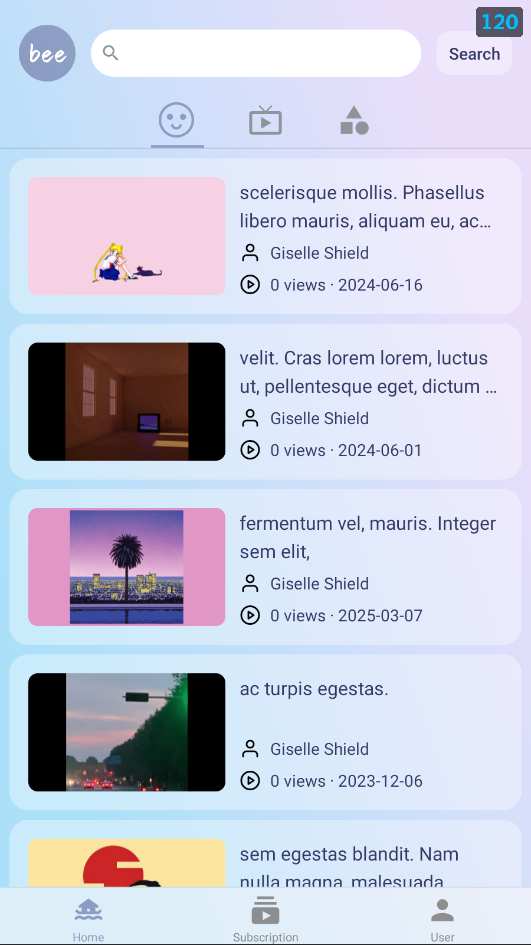

## Video Page

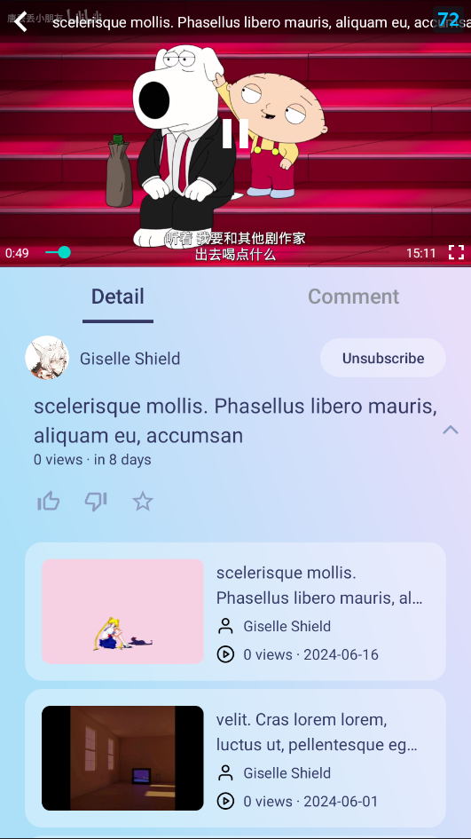

## Comment Page

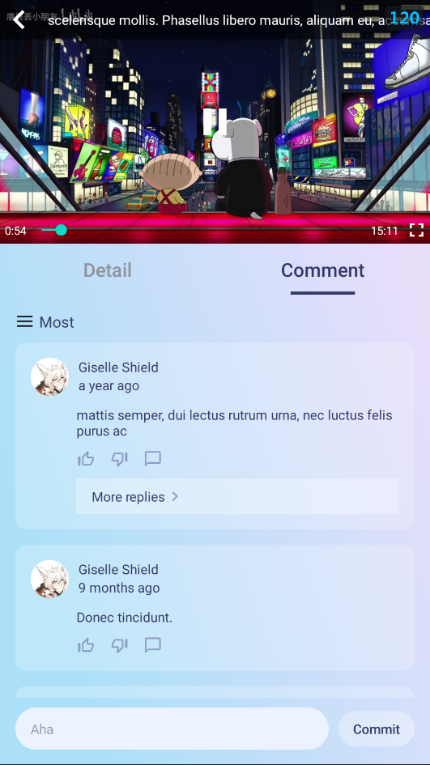

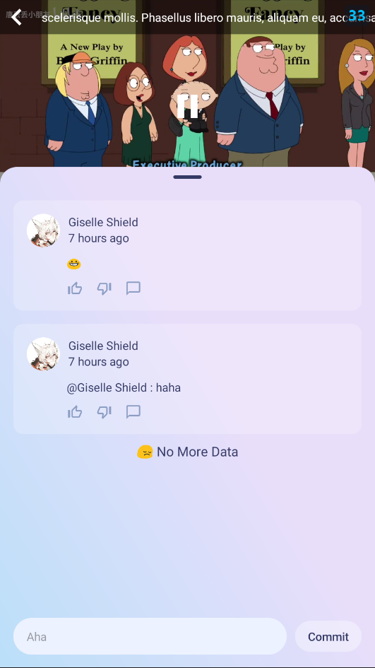

## Live Page

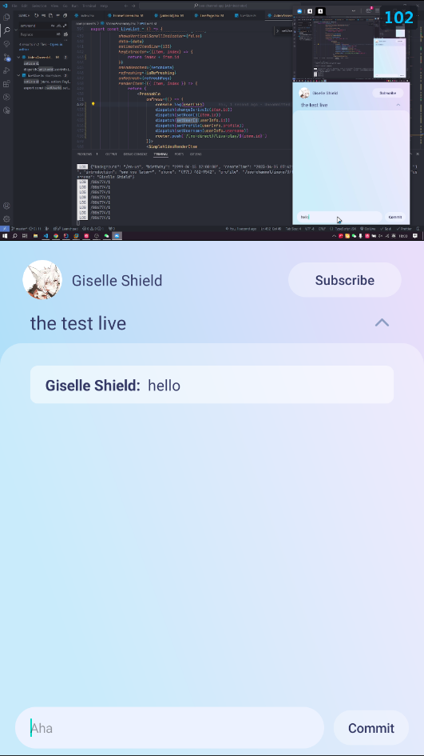

## User Related Pages

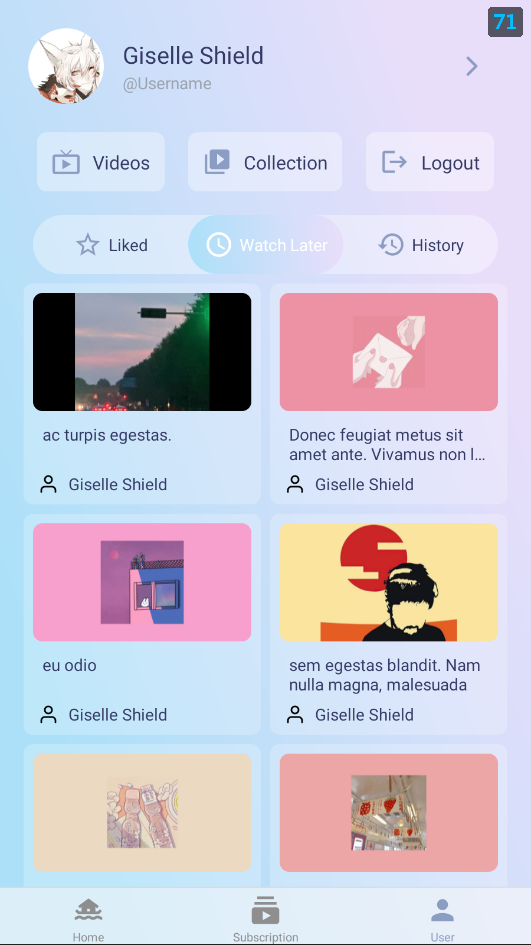

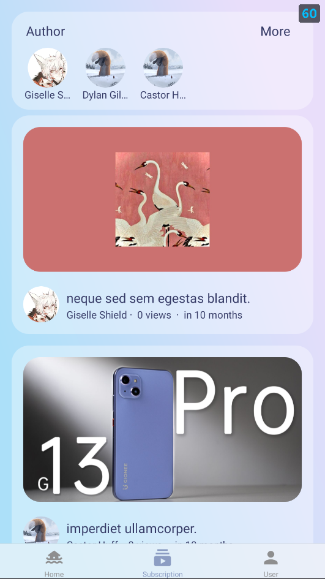

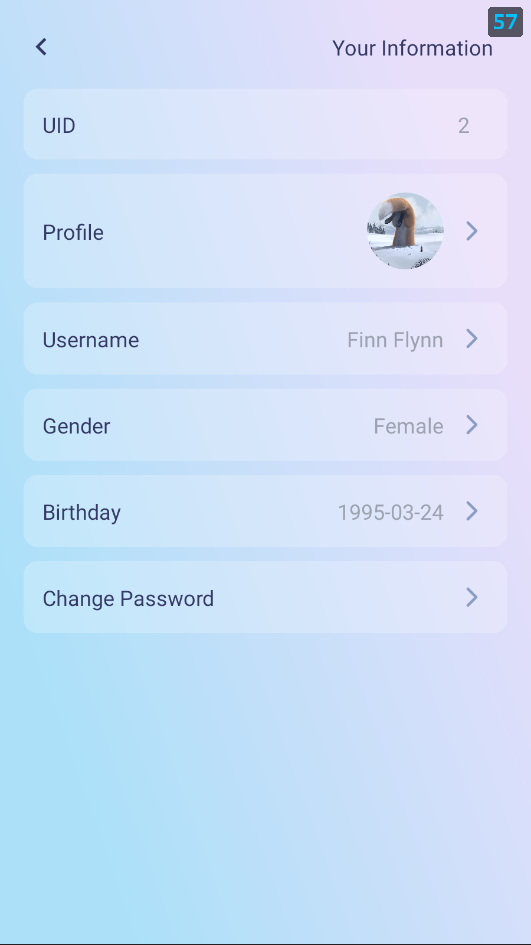

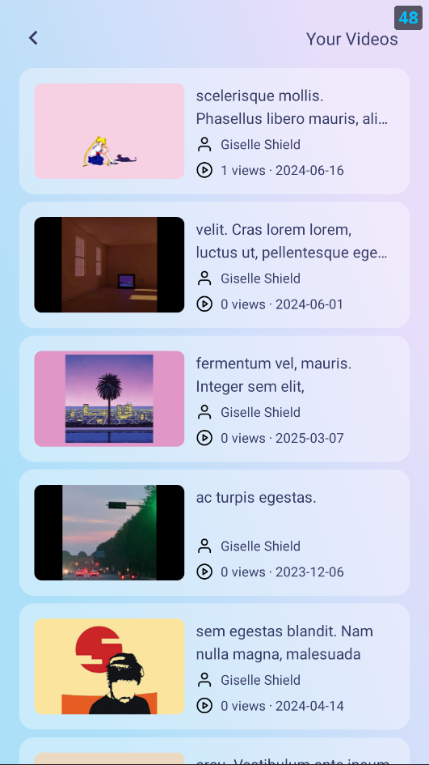

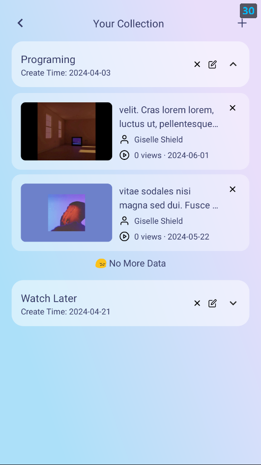

## Log In Pages

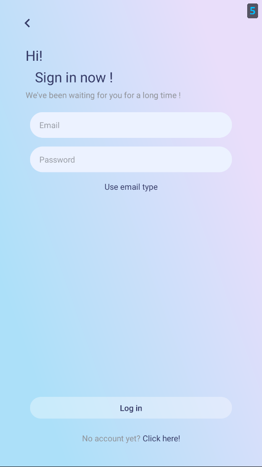

## Sign Up Page

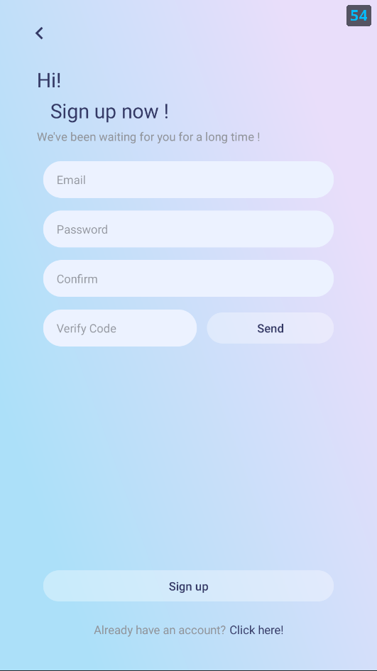

## Search Page

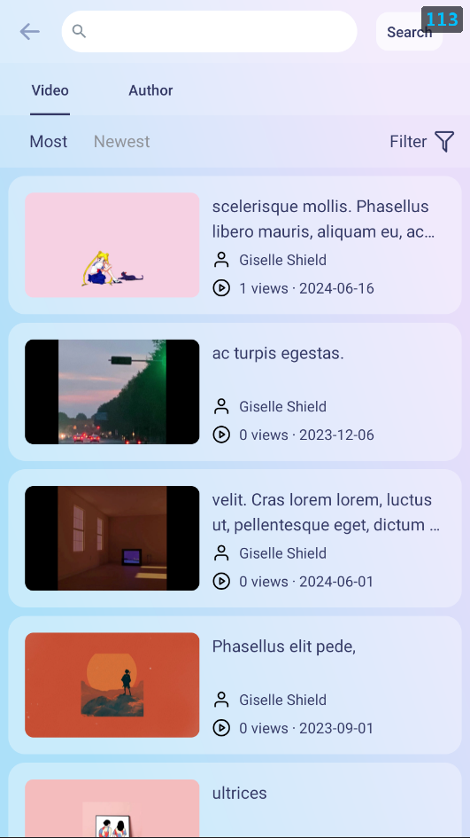

## Category Page

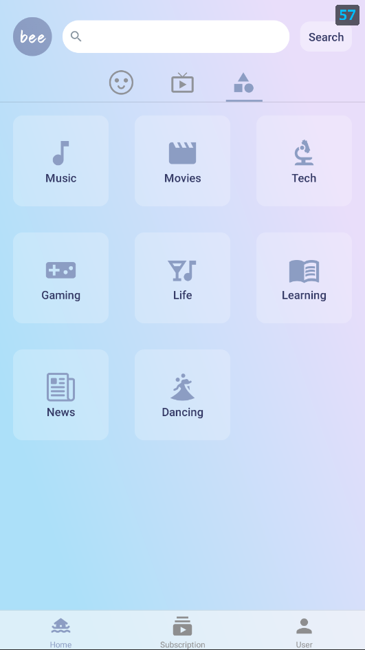

## License

Licensed under the [MIT license](https://github.com/nextui-org/next-app-template/blob/main/LICENSE).
